# Shadows of Dungeon Layout 1

## 0000

### Base

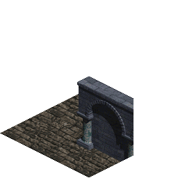

### Shadow

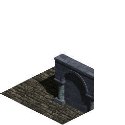

## 0001

### Base

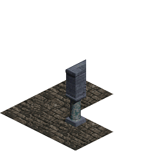

### Shadow

## 0002

### Base

### Shadow

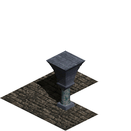

## 0003

### Base

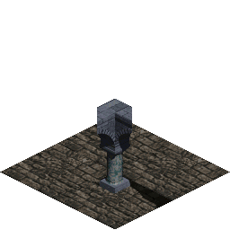

### Shadow

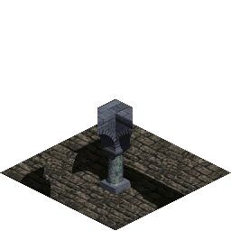

## 0004

### Base

### Shadow

## 0005

### Base

### Shadow

## 0006

### Base

### Shadow

## 0007

### Base

### Shadow

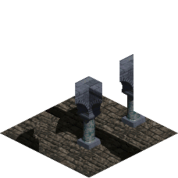

## 0008

### Base

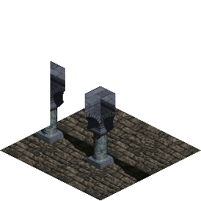

### Shadow

## 0009

### Base

### Shadow

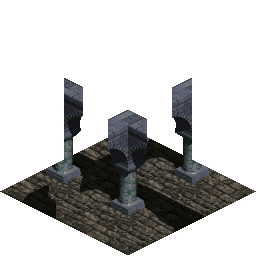

## 0010

### Base

### Shadow

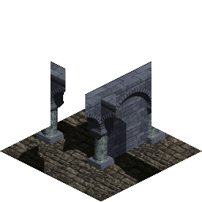

## 0011

### Base

### Shadow

## 0012

### Base

### Shadow

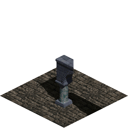

## 0013

### Base

### Shadow

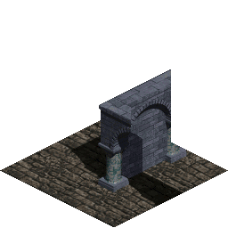

## 0014

### Base

### Shadow

## 0015

### Base

### Shadow

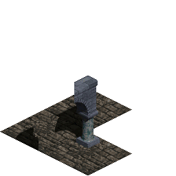

## 0016

### Base

### Shadow

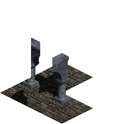

## 0017

### Base

### Shadow

## 0018

### Base

### Shadow

## 0019

### Base

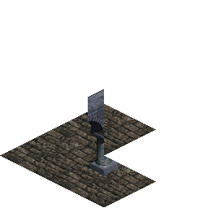

### Shadow

## 0020

### Base

### Shadow

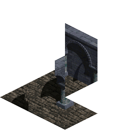

## 0021

### Base

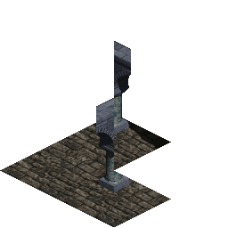

### Shadow

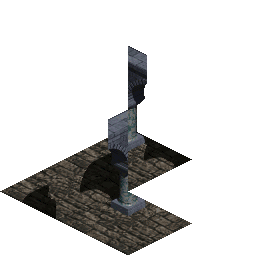

## 0022

### Base

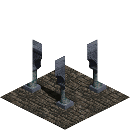

### Shadow

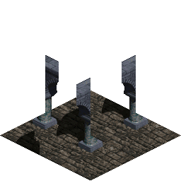

## 0023

### Base

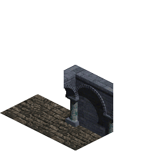

### Shadow

## 0024

### Base

### Shadow

## 0025

### Base

### Shadow

## 0026

### Base

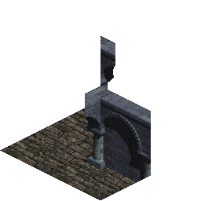

### Shadow

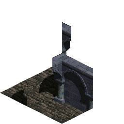

## 0027

### Base

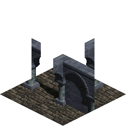

### Shadow

## 0028

### Base

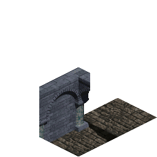

### Shadow

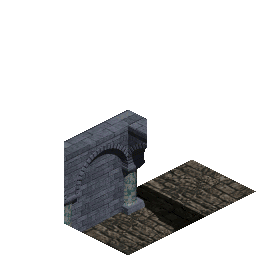

## 0029

### Base

### Shadow

## 0030

### Base

### Shadow

## 0031

### Base

### Shadow

## 0032

### Base

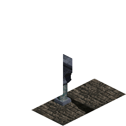

### Shadow

## 0033

### Base

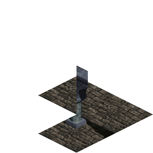

### Shadow

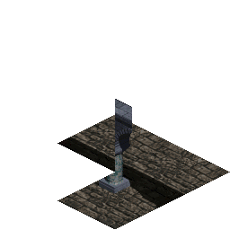

## 0034

### Base

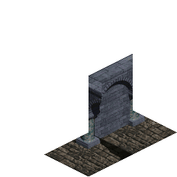

### Shadow

## 0035

### Base

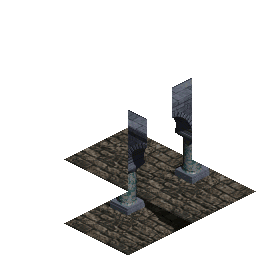

### Shadow

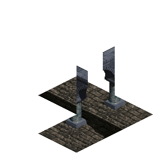

## 0036

### Base

### Shadow

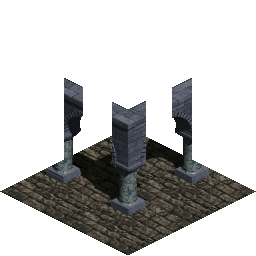
