# Squares of Dungeon Layout 1

## 0001

### Wall SW

Base square: [Wall SW](https://github.com/sanctuary/graphics/blob/master/l1/squares/base.md#0001).

## 0002

### Wall SE

Base square: [Wall SE](https://github.com/sanctuary/graphics/blob/master/l1/squares/base.md#0002).

## 0003

### Arch NE Arch NW

Base square: [Arch NE Arch NW](https://github.com/sanctuary/graphics/blob/master/l1/squares/base.md#0003).

## 0004

### Wall SW Wall SE

Base square: [Wall SW Wall SE](https://github.com/sanctuary/graphics/blob/master/l1/squares/base.md#0004).

## 0005

### Arch SW Arch SE

Base square: [Arch SW Arch SE](https://github.com/sanctuary/graphics/blob/master/l1/squares/base.md#0005).

## 0006

### Wall End SW

Base square: [Wall End SW](https://github.com/sanctuary/graphics/blob/master/l1/squares/base.md#0006).

## 0007

### Wall End SE

Base square: [Wall End SE](https://github.com/sanctuary/graphics/blob/master/l1/squares/base.md#0007).

## 0008

### Arch End SW

Base square: [Arch End SW](https://github.com/sanctuary/graphics/blob/master/l1/squares/base.md#0008).

## 0009

### Arch End SE

Base square: [Arch End SE](https://github.com/sanctuary/graphics/blob/master/l1/squares/base.md#0009).

## 0010

### Wall SW Arch SE

Base square: [Wall SW Arch SE](https://github.com/sanctuary/graphics/blob/master/l1/squares/base.md#0010).

## 0011

### Arch SW

Base square: [Arch SW](https://github.com/sanctuary/graphics/blob/master/l1/squares/base.md#0011).

## 0012

### Arch SE

Base square: [Arch SE](https://github.com/sanctuary/graphics/blob/master/l1/squares/base.md#0012).

## 0013

### Floor

Base square: [Floor](https://github.com/sanctuary/graphics/blob/master/l1/squares/base.md#0013).

## 0014

### Arch SW Wall SE

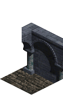

Base square: [Arch SW Wall SE](https://github.com/sanctuary/graphics/blob/master/l1/squares/base.md#0014).

## 0015

### Column

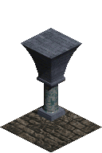

Base square: [Column](https://github.com/sanctuary/graphics/blob/master/l1/squares/base.md#0015).

## 0016

### Arch End NE

Base square: [Arch End NE](https://github.com/sanctuary/graphics/blob/master/l1/squares/base.md#0016).

## 0017

### Arch End NW

Base square: [Arch End NW](https://github.com/sanctuary/graphics/blob/master/l1/squares/base.md#0017).

## 0018

### Dirt Wall SW

Base square: None.

## 0019

### Dirt Wall SE

Base square: None.

## 0020

### Dirt Wall NE Wall NW

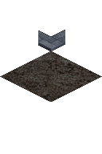

Base square: None.

## 0021

### Dirt Wall SW Wall SE

Base square: None.

## 0022

### Dirt

Base square: None.

## 0023

### Dirt Wall End SW

Base square: None.

## 0024

### Dirt Wall End SE

Base square: None.

## 0025

### Door SW

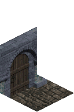

Base square: [Wall SW](https://github.com/sanctuary/graphics/blob/master/l1/squares/base.md#0001).

## 0026

### Door SE

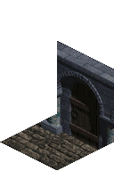

Base square: [Wall SE](https://github.com/sanctuary/graphics/blob/master/l1/squares/base.md#0002).

## 0027

### Wall SW Bar SE

Base square: [Wall SW Arch SE](https://github.com/sanctuary/graphics/blob/master/l1/squares/base.md#0010).

## 0028

### Door SW Door SE

Base square: [Wall SW Wall SE](https://github.com/sanctuary/graphics/blob/master/l1/squares/base.md#0004).

## 0029

### Bar SW Bar SE

Base square: [Arch SW Arch SE](https://github.com/sanctuary/graphics/blob/master/l1/squares/base.md#0005).

## 0030

### Door End SW

Base square: [Wall End SW](https://github.com/sanctuary/graphics/blob/master/l1/squares/base.md#0006).

## 0031

### Door End SE

Base square: [Wall End SE](https://github.com/sanctuary/graphics/blob/master/l1/squares/base.md#0007).

## 0032

### Bar End SW

Base square: [Arch End SW](https://github.com/sanctuary/graphics/blob/master/l1/squares/base.md#0008).

## 0033

### Bar End SE

Base square: [Arch End SE](https://github.com/sanctuary/graphics/blob/master/l1/squares/base.md#0009).

## 0034

### Door SW Bar SE

Base square: [Wall SW Arch SE](https://github.com/sanctuary/graphics/blob/master/l1/squares/base.md#0010).

## 0035

### Bar SW

Base square: [Arch SW](https://github.com/sanctuary/graphics/blob/master/l1/squares/base.md#0011).

## 0036

### Bar SE

Base square: [Arch SE](https://github.com/sanctuary/graphics/blob/master/l1/squares/base.md#0012).

## 0037

### Bar SW Wall SE

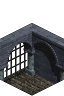

Base square: [Arch SW Wall SE](https://github.com/sanctuary/graphics/blob/master/l1/squares/base.md#0014).

## 0038

### Bar SW Arch SE

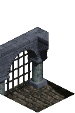

Base square: [Arch SW Arch SE](https://github.com/sanctuary/graphics/blob/master/l1/squares/base.md#0005).

## 0039

### Bar SW Door SE

Base square: [Arch SW Wall SE](https://github.com/sanctuary/graphics/blob/master/l1/squares/base.md#0014).

## 0040

### Door SW Arch SE

Base square: [Wall SW Arch SE](https://github.com/sanctuary/graphics/blob/master/l1/squares/base.md#0010).

## 0041

### Door SW Wall SE

Base square: [Wall SW Wall SE](https://github.com/sanctuary/graphics/blob/master/l1/squares/base.md#0004).

## 0042

### Arch SW Door SE

Base square: [Arch SW Wall SE](https://github.com/sanctuary/graphics/blob/master/l1/squares/base.md#0014).

## 0043

### Wall SW Door SE

Base square: [Wall SW Wall SE](https://github.com/sanctuary/graphics/blob/master/l1/squares/base.md#0004).

## 0044

### Arch SW Bar SE

Base square: [Arch SW Arch SE](https://github.com/sanctuary/graphics/blob/master/l1/squares/base.md#0005).

## 0045

### Circle Marking 1

Base square: None.

## 0046

### Circle Marking 2

Base square: None.

## 0047

### Circle Marking 3

Base square: None.

## 0048

### Circle Marking 4

Base square: None.

## 0049

### Circle Marking 5

Base square: None.

## 0050

### Circle Marking 6

Base square: None.

## 0051

### Circle Marking 7

Base square: None.

## 0052

### Circle Marking 8

Base square: None.

## 0053

### Circle Marking 9

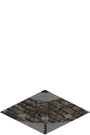

Base square: None.

## 0054

### Circle Marking 10

Base square: None.

## 0055

### Circle Marking 11

Base square: None.

## 0056

### Circle Marking 12

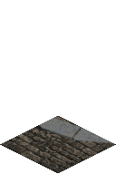

Base square: None.

## 0057

### Stair A 1

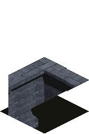

Base square: None.

## 0058

### Stair A 2

Base square: None.

## 0059

### Stair A 3

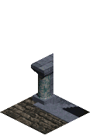

Base square: None.

## 0060

### Stair A 4

Base square: None.

## 0061

### Stair A 5

Base square: None.

## 0062

### Stair A 6

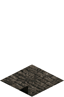

Base square: None.

## 0063

### Stair B 1

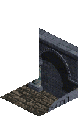

Base square: None.

## 0064

### Stair B 2

Base square: None.

## 0065

### Stair B 3

Base square: None.

## 0066

### Stair B 4

Base square: None.

## 0067

### Stair B 5

Base square: None.

## 0068

### Stair B 6

Base square: None.

## 0069

### Tomb 1

Base square: None.

## 0070

### Tomb 2

Base square: None.

## 0071

### Tomb 3

Base square: None.

## 0072

### Tomb 4

Base square: None.

## 0073

### Tomb 5

Base square: None.

## 0074

### Tomb 6

Base square: None.

## 0075

### Tomb 7

Base square: None.

## 0076

### Tomb 8

Base square: None.

## 0077

### Tomb 9

Base square: None.

## 0078

### Tomb 10

Base square: None.

## 0079

### Wall SW 2

Base square: [Wall SW](https://github.com/sanctuary/graphics/blob/master/l1/squares/base.md#0001).

## 0080

### Wall SE 2

Base square: [Wall SE](https://github.com/sanctuary/graphics/blob/master/l1/squares/base.md#0002).

## 0081

### Wall NE Wall NW

Base square: [Arch NE Arch NW](https://github.com/sanctuary/graphics/blob/master/l1/squares/base.md#0003).

## 0082

### Wall SW Wall SE 2

Base square: [Wall SW Wall SE](https://github.com/sanctuary/graphics/blob/master/l1/squares/base.md#0004).

## 0083

### Wall SW 3

Base square: [Wall SW](https://github.com/sanctuary/graphics/blob/master/l1/squares/base.md#0001).

## 0084

### Wall End SW 2

Base square: [Wall End SW](https://github.com/sanctuary/graphics/blob/master/l1/squares/base.md#0006).

## 0085

### Wall End SE 2

Base square: [Wall End SE](https://github.com/sanctuary/graphics/blob/master/l1/squares/base.md#0007).

## 0086

### Wall End NE

Base square: [Arch End NE](https://github.com/sanctuary/graphics/blob/master/l1/squares/base.md#0016).

## 0087

### Wall End NW

Base square: [Arch End NW](https://github.com/sanctuary/graphics/blob/master/l1/squares/base.md#0017).

## 0088

### Wall SE 3

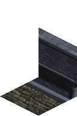

Base square: [Wall SE](https://github.com/sanctuary/graphics/blob/master/l1/squares/base.md#0002).

## 0089

### Tapestry Wall SW 1

Base square: [Wall SW](https://github.com/sanctuary/graphics/blob/master/l1/squares/base.md#0001).
Undecorated square: [Wall SW 2](https://github.com/sanctuary/graphics/blob/master/l1/squares/README.md#0079).

## 0090

### Tapestry Wall SW 2

Base square: [Wall SW](https://github.com/sanctuary/graphics/blob/master/l1/squares/base.md#0001).

## 0091

### Tapestry Wall SE 1

Base square: [Wall SE](https://github.com/sanctuary/graphics/blob/master/l1/squares/base.md#0002).
Undecorated square: [Wall SE 2](https://github.com/sanctuary/graphics/blob/master/l1/squares/README.md#0080).

## 0092

### Tapestry Wall SE 2

Base square: [Wall SE](https://github.com/sanctuary/graphics/blob/master/l1/squares/base.md#0002).

## 0093

### Wall SW 4

Base square: [Wall SW](https://github.com/sanctuary/graphics/blob/master/l1/squares/base.md#0001).

## 0094

### Tomb Wall SW

Base square: [Wall SW](https://github.com/sanctuary/graphics/blob/master/l1/squares/base.md#0001).
Undecorated square: [Wall SW 2](https://github.com/sanctuary/graphics/blob/master/l1/squares/README.md#0079).

## 0095

### Tomb Wall SE

Base square: [Wall SE](https://github.com/sanctuary/graphics/blob/master/l1/squares/base.md#0002).
Undecorated square: [Wall SE 2](https://github.com/sanctuary/graphics/blob/master/l1/squares/README.md#0080).

## 0096

### Wall SE 4

Base square: [Wall SE](https://github.com/sanctuary/graphics/blob/master/l1/squares/base.md#0002).

## 0097

### Blood Wall SE 1

Base square: [Wall SE](https://github.com/sanctuary/graphics/blob/master/l1/squares/base.md#0002).
Undecorated square: [Wall SE](https://github.com/sanctuary/graphics/blob/master/l1/squares/README.md#0002).

## 0098

### Blood Wall SE 2

Base square: [Wall SE](https://github.com/sanctuary/graphics/blob/master/l1/squares/base.md#0002).
Undecorated square: [Wall SE](https://github.com/sanctuary/graphics/blob/master/l1/squares/README.md#0002).

## 0099

### Blood Wall SE 3

Base square: [Wall SE](https://github.com/sanctuary/graphics/blob/master/l1/squares/base.md#0002).
Undecorated square: [Wall SE](https://github.com/sanctuary/graphics/blob/master/l1/squares/README.md#0002).

## 0100

### Blood Wall SW 1

Base square: [Wall SW](https://github.com/sanctuary/graphics/blob/master/l1/squares/base.md#0001).
Undecorated square: [Wall SW](https://github.com/sanctuary/graphics/blob/master/l1/squares/README.md#0001).

## 0101

### Blood Wall SW 2

Base square: [Wall SW](https://github.com/sanctuary/graphics/blob/master/l1/squares/base.md#0001).
Undecorated square: [Wall SW](https://github.com/sanctuary/graphics/blob/master/l1/squares/README.md#0001).

## 0102

### Blood Arch SW

Base square: [Arch SW](https://github.com/sanctuary/graphics/blob/master/l1/squares/base.md#0011).
Undecorated square: [Arch SW](https://github.com/sanctuary/graphics/blob/master/l1/squares/README.md#0011).

## 0103

### Blood Door SW

Base square: [Wall SW](https://github.com/sanctuary/graphics/blob/master/l1/squares/base.md#0001).
Undecorated square: [Door SW](https://github.com/sanctuary/graphics/blob/master/l1/squares/README.md#0025).

## 0104

### Blood Floor 1

Base square: [Floor](https://github.com/sanctuary/graphics/blob/master/l1/squares/base.md#0013).
Undecorated square: [Floor](https://github.com/sanctuary/graphics/blob/master/l1/squares/README.md#0013).

## 0105

### Blood Floor 2

Base square: [Floor](https://github.com/sanctuary/graphics/blob/master/l1/squares/base.md#0013).
Undecorated square: [Floor](https://github.com/sanctuary/graphics/blob/master/l1/squares/README.md#0013).

## 0106

### Blood Floor 3

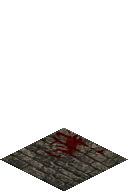

Base square: [Floor](https://github.com/sanctuary/graphics/blob/master/l1/squares/base.md#0013).
Undecorated square: [Floor](https://github.com/sanctuary/graphics/blob/master/l1/squares/README.md#0013).

## 0107

### Cross Wall SW

Base square: [Wall SW](https://github.com/sanctuary/graphics/blob/master/l1/squares/base.md#0001).
Undecorated square: [Wall SW](https://github.com/sanctuary/graphics/blob/master/l1/squares/README.md#0001).

## 0108

### Cross Wall SE

Base square: [Wall SE](https://github.com/sanctuary/graphics/blob/master/l1/squares/base.md#0002).
Undecorated square: [Wall SE](https://github.com/sanctuary/graphics/blob/master/l1/squares/README.md#0002).

## 0109

### Niche Wall SW

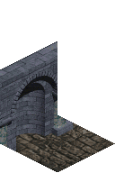

Base square: [Wall SW](https://github.com/sanctuary/graphics/blob/master/l1/squares/base.md#0001).
Undecorated square: [Wall SW](https://github.com/sanctuary/graphics/blob/master/l1/squares/README.md#0001).

## 0110

### Niche Wall SE

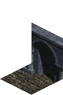

Base square: [Wall SE](https://github.com/sanctuary/graphics/blob/master/l1/squares/base.md#0002).
Undecorated square: [Wall SE](https://github.com/sanctuary/graphics/blob/master/l1/squares/README.md#0002).

## 0111

### Statue Wall SW

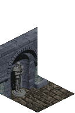

Base square: [Wall SW](https://github.com/sanctuary/graphics/blob/master/l1/squares/base.md#0001).
Undecorated square: [Wall SW](https://github.com/sanctuary/graphics/blob/master/l1/squares/README.md#0001).

## 0112

### Statue Wall SE

Base square: [Wall SE](https://github.com/sanctuary/graphics/blob/master/l1/squares/base.md#0002).
Undecorated square: [Wall SE](https://github.com/sanctuary/graphics/blob/master/l1/squares/README.md#0002).

## 0113

### Torch Wall SW

Base square: [Wall SW](https://github.com/sanctuary/graphics/blob/master/l1/squares/base.md#0001).
Undecorated square: [Wall SW](https://github.com/sanctuary/graphics/blob/master/l1/squares/README.md#0001).

## 0114

### Torch Wall SE

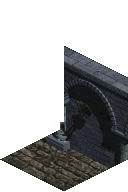

Base square: [Wall SE](https://github.com/sanctuary/graphics/blob/master/l1/squares/base.md#0002).
Undecorated square: [Wall SE](https://github.com/sanctuary/graphics/blob/master/l1/squares/README.md#0002).

## 0115

### Broken Wall SE 1

Base square: [Wall SE](https://github.com/sanctuary/graphics/blob/master/l1/squares/base.md#0002).
Undecorated square: [Wall SE](https://github.com/sanctuary/graphics/blob/master/l1/squares/README.md#0002).

## 0116

### Broken Wall SE 2

Base square: [Wall SE](https://github.com/sanctuary/graphics/blob/master/l1/squares/base.md#0002).
Undecorated square: [Wall SE](https://github.com/sanctuary/graphics/blob/master/l1/squares/README.md#0002).

## 0117

### Broken Wall SE 3

Base square: [Wall SE](https://github.com/sanctuary/graphics/blob/master/l1/squares/base.md#0002).
Undecorated square: [Wall SE](https://github.com/sanctuary/graphics/blob/master/l1/squares/README.md#0002).

## 0118

### Broken Arch SE

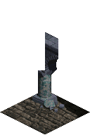

Base square: [Arch SE](https://github.com/sanctuary/graphics/blob/master/l1/squares/base.md#0012).
Undecorated square: [Arch SE](https://github.com/sanctuary/graphics/blob/master/l1/squares/README.md#0012).

## 0119

### Broken Enterance SE 1

Base square: None.

## 0120

### Broken Enterance SE 2

Base square: None.

## 0121

### Broken Arch SW 1

Base square: [Arch SW](https://github.com/sanctuary/graphics/blob/master/l1/squares/base.md#0011).
Undecorated square: [Arch SW](https://github.com/sanctuary/graphics/blob/master/l1/squares/README.md#0011).

## 0122

### Broken Wall SW 1

Base square: [Wall SW](https://github.com/sanctuary/graphics/blob/master/l1/squares/base.md#0001).
Undecorated square: [Wall SW](https://github.com/sanctuary/graphics/blob/master/l1/squares/README.md#0001).

## 0123

### Broken Arch SW 2

Base square: [Arch SW](https://github.com/sanctuary/graphics/blob/master/l1/squares/base.md#0011).
Undecorated square: [Arch SW](https://github.com/sanctuary/graphics/blob/master/l1/squares/README.md#0011).

## 0124

### Broken Wall SW 2

Base square: [Wall SW](https://github.com/sanctuary/graphics/blob/master/l1/squares/base.md#0001).
Undecorated square: [Wall SW](https://github.com/sanctuary/graphics/blob/master/l1/squares/README.md#0001).

## 0125

### Broken Floor 1

Base square: [Floor](https://github.com/sanctuary/graphics/blob/master/l1/squares/base.md#0013).
Undecorated square: [Floor](https://github.com/sanctuary/graphics/blob/master/l1/squares/README.md#0013).

## 0126

### Broken Enterance SW 1

Base square: None.

## 0127

### Broken Enterance SW 2

Base square: None.

## 0128

### Candlestick 1

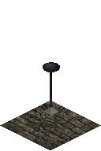

Base square: None.

## 0129

### Candlestick 2

Base square: None.

## 0130

### Candlestick 3

Base square: None.

## 0131

### Sarcophagus 1

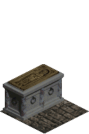

Base square: None.

## 0132

### Sarcophagus 2

Base square: None.

## 0133

### Broken Floor 2

Base square: [Floor](https://github.com/sanctuary/graphics/blob/master/l1/squares/base.md#0013).
Undecorated square: [Floor](https://github.com/sanctuary/graphics/blob/master/l1/squares/README.md#0013).

## 0134

### Broken Floor 3

Base square: [Floor](https://github.com/sanctuary/graphics/blob/master/l1/squares/base.md#0013).
Undecorated square: [Floor](https://github.com/sanctuary/graphics/blob/master/l1/squares/README.md#0013).

## 0135

### Broken Floor 4

Base square: [Floor](https://github.com/sanctuary/graphics/blob/master/l1/squares/base.md#0013).
Undecorated square: [Floor](https://github.com/sanctuary/graphics/blob/master/l1/squares/README.md#0013).

## 0136

### Broken Floor 5

Base square: [Floor](https://github.com/sanctuary/graphics/blob/master/l1/squares/base.md#0013).
Undecorated square: [Floor](https://github.com/sanctuary/graphics/blob/master/l1/squares/README.md#0013).

## 0137

### Broken Floor 6

Base square: [Floor](https://github.com/sanctuary/graphics/blob/master/l1/squares/base.md#0013).
Undecorated square: [Floor](https://github.com/sanctuary/graphics/blob/master/l1/squares/README.md#0013).

## 0138

### Broken Floor 7

Base square: [Floor](https://github.com/sanctuary/graphics/blob/master/l1/squares/base.md#0013).
Undecorated square: [Floor](https://github.com/sanctuary/graphics/blob/master/l1/squares/README.md#0013).

## 0139

### Floor Shadow Arch SW Right

Base square: [Floor](https://github.com/sanctuary/graphics/blob/master/l1/squares/base.md#0013).

## 0140

### Floor Shadow Arch SE Left

Base square: [Floor](https://github.com/sanctuary/graphics/blob/master/l1/squares/base.md#0013).

## 0141

### Floor Shadow Bar SW Right

Base square: [Floor](https://github.com/sanctuary/graphics/blob/master/l1/squares/base.md#0013).

## 0142

### Floor Shadow Shaft Right

Base square: [Floor](https://github.com/sanctuary/graphics/blob/master/l1/squares/base.md#0013).

## 0143

### Floor Shadow Arch SE Left Shaft Bottom

Base square: [Floor](https://github.com/sanctuary/graphics/blob/master/l1/squares/base.md#0013).

## 0144

### Floor Shadow Shaft Bottom 1

Base square: [Floor](https://github.com/sanctuary/graphics/blob/master/l1/squares/base.md#0013).

## 0145

### Floor Shadow Column Bottom

Base square: [Floor](https://github.com/sanctuary/graphics/blob/master/l1/squares/base.md#0013).

## 0146

### Wall SW Shadow Arch SE Left

Base square: [Wall SW](https://github.com/sanctuary/graphics/blob/master/l1/squares/base.md#0001).

## 0147

### Arch SW Shadow Arch SE Left

Base square: [Arch SW](https://github.com/sanctuary/graphics/blob/master/l1/squares/base.md#0011).

## 0148

### Wall SE Shadow Arch SW Right

Base square: [Wall SE](https://github.com/sanctuary/graphics/blob/master/l1/squares/base.md#0002).

## 0149

### Arch SE Shadow Arch SW Right

Base square: [Arch SE](https://github.com/sanctuary/graphics/blob/master/l1/squares/base.md#0012).

## 0150

### Floor Shadow Arch SE Left Arch SW Right

Base square: [Floor](https://github.com/sanctuary/graphics/blob/master/l1/squares/base.md#0013).

## 0151

### Floor Shadow Shaft Bottom Arch SW Right

Base square: [Floor](https://github.com/sanctuary/graphics/blob/master/l1/squares/base.md#0013).

## 0152

### Floor Shadow Shaft Bottom 2

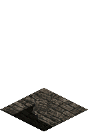

Base square: [Floor](https://github.com/sanctuary/graphics/blob/master/l1/squares/base.md#0013).

## 0153

### Arch SE Shadow Bar SW Right

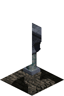

Base square: [Arch SE](https://github.com/sanctuary/graphics/blob/master/l1/squares/base.md#0012).

## 0154

### Wall SE Shadow Bar SW Right

Base square: [Wall SE](https://github.com/sanctuary/graphics/blob/master/l1/squares/base.md#0002).

## 0155

### Wall SW 3 Shadow Arch SE Left

Base square: [Wall SW](https://github.com/sanctuary/graphics/blob/master/l1/squares/base.md#0001).

## 0156

### Wall SE 3 Shadow Arch SW Right

Base square: [Wall SE](https://github.com/sanctuary/graphics/blob/master/l1/squares/base.md#0002).

## 0157

### Wall SE 3 Shadow Bar SW Right

Base square: [Wall SE](https://github.com/sanctuary/graphics/blob/master/l1/squares/base.md#0002).

## 0158

### Wall SW Wall SE 3

Base square: [Wall SW Wall SE](https://github.com/sanctuary/graphics/blob/master/l1/squares/base.md#0004).

## 0159

### Arch SW Wall SE 3

Base square: [Arch SW Wall SE](https://github.com/sanctuary/graphics/blob/master/l1/squares/base.md#0014).

## 0160

### Wall SW 3 Wall SE

Base square: [Wall SW Wall SE](https://github.com/sanctuary/graphics/blob/master/l1/squares/base.md#0004).

## 0161

### Wall SW 3 Arch SE

Base square: [Wall SW Arch SE](https://github.com/sanctuary/graphics/blob/master/l1/squares/base.md#0010).

## 0162

### Floor 2

Base square: [Floor](https://github.com/sanctuary/graphics/blob/master/l1/squares/base.md#0013).

## 0163

### Floor 3

Base square: [Floor](https://github.com/sanctuary/graphics/blob/master/l1/squares/base.md#0013).

## 0164

### Door SW Wall SE 3

Base square: [Wall SW Wall SE](https://github.com/sanctuary/graphics/blob/master/l1/squares/base.md#0004).

## 0165

### Wall SW 3 Door SE

Base square: [Wall SW Wall SE](https://github.com/sanctuary/graphics/blob/master/l1/squares/base.md#0004).

## 0166

### Blood Wall SW 3

Base square: [Wall SW](https://github.com/sanctuary/graphics/blob/master/l1/squares/base.md#0001).

## 0167

### Blood Wall SW 4

Base square: [Wall SW](https://github.com/sanctuary/graphics/blob/master/l1/squares/base.md#0001).

## 0168

### Blood Wall SW Wall SE

Base square: [Wall SW Wall SE](https://github.com/sanctuary/graphics/blob/master/l1/squares/base.md#0004).

## 0169

### Blood Wall SE 4

Base square: [Wall SE](https://github.com/sanctuary/graphics/blob/master/l1/squares/base.md#0002).

## 0170

### Blood Wall SE 5

Base square: [Wall SE](https://github.com/sanctuary/graphics/blob/master/l1/squares/base.md#0002).

## 0171

### Blood Floor 4

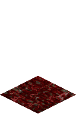

Base square: [Floor](https://github.com/sanctuary/graphics/blob/master/l1/squares/base.md#0013).

## 0172

### Blood Floor 5

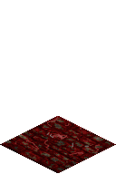

Base square: [Floor](https://github.com/sanctuary/graphics/blob/master/l1/squares/base.md#0013).

## 0173

### Blood Floor 6

Base square: [Floor](https://github.com/sanctuary/graphics/blob/master/l1/squares/base.md#0013).

## 0174

### Blood Floor 7

Base square: [Floor](https://github.com/sanctuary/graphics/blob/master/l1/squares/base.md#0013).

## 0175

### Open Door SW

Base square: [Door SW](https://github.com/sanctuary/graphics/blob/master/l1/squares/base.md#0025).

## 0176

### Open Door SE

Base square: [Door SE](https://github.com/sanctuary/graphics/blob/master/l1/squares/base.md#0026).

## 0177

### Open Door SW Open Door SE

Base square: [Door SW Door SE](https://github.com/sanctuary/graphics/blob/master/l1/squares/base.md#0028).

## 0178

### Open Door End SW

Base square: [Door End SW](https://github.com/sanctuary/graphics/blob/master/l1/squares/base.md#0030).

## 0179

### Open Door End SE

Base square: [Door End SE](https://github.com/sanctuary/graphics/blob/master/l1/squares/base.md#0031).

## 0180

### Open Door SW Bar SE

Base square: [Door SW Wall SE](https://github.com/sanctuary/graphics/blob/master/l1/squares/base.md#0041).

## 0181

### Bar SW Open Door SE

Base square: [Wall SW Door SE](https://github.com/sanctuary/graphics/blob/master/l1/squares/base.md#0043).

## 0182

### Open Door SW Arch SE

Base square: [Door SW Arch SE](https://github.com/sanctuary/graphics/blob/master/l1/squares/base.md#0040).

## 0183

### Open Door SW Wall SE

Base square: [Door SW Wall SE](https://github.com/sanctuary/graphics/blob/master/l1/squares/base.md#0041).

## 0184

### Arch SW Open Door SE

Base square: [Arch SW Door SE](https://github.com/sanctuary/graphics/blob/master/l1/squares/base.md#0042).

## 0185

### Wall SW Open Door SE

Base square: [Wall SW Door SE](https://github.com/sanctuary/graphics/blob/master/l1/squares/base.md#0043).

## 0186

### Open Blood Door SW

Base square: [Door SW](https://github.com/sanctuary/graphics/blob/master/l1/squares/base.md#0025).

## 0187

### Open Door SW Wall SE 3

Base square: [Door SW Wall SE](https://github.com/sanctuary/graphics/blob/master/l1/squares/base.md#0041).

## 0188

### Wall SW 3 Open Door SE

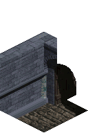

Base square: [Wall SW Door SE](https://github.com/sanctuary/graphics/blob/master/l1/squares/base.md#0043).

## 0189

### Open Door SW Door SE

Base square: [Door SW Door SE](https://github.com/sanctuary/graphics/blob/master/l1/squares/base.md#0028).

## 0190

### Door SW Open Door SE

Base square: [Door SW Door SE](https://github.com/sanctuary/graphics/blob/master/l1/squares/base.md#0028).

## 0191

### Wall SW 5

Base square: [Wall SW](https://github.com/sanctuary/graphics/blob/master/l1/squares/base.md#0001).

## 0192

### Wall SE 5

Base square: [Wall SE](https://github.com/sanctuary/graphics/blob/master/l1/squares/base.md#0002).

## 0193

### Enterance SW 1

Base square: [Door SW](https://github.com/sanctuary/graphics/blob/master/l1/squares/base.md#0025).

## 0194

### Enterance SE 1

Base square: [Door SE](https://github.com/sanctuary/graphics/blob/master/l1/squares/base.md#0026).

## 0195

### Dirt Floor Shadow

Base square: [Dirt](https://github.com/sanctuary/graphics/blob/master/l1/squares/base.md#0022).

## 0196

### Dirt Floor Shadow Arch SW Right

Base square: [Dirt](https://github.com/sanctuary/graphics/blob/master/l1/squares/base.md#0022).

## 0197

### Enterance SW 2

Base square: [Door SW](https://github.com/sanctuary/graphics/blob/master/l1/squares/base.md#0025).

## 0198

### Enterance SE 2

Base square: [Door SE](https://github.com/sanctuary/graphics/blob/master/l1/squares/base.md#0026).

## 0199

### Dirt Wall SW Dirt

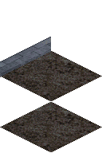

Base square: None.

## 0200

### Dirt Wall SE Dirt

Base square: None.

## 0201

### Dirt Wall NE Wall NW Dirt

Base square: None.

## 0202

### Dirt Wall SW Wall SE Dirt

Base square: None.

## 0203

### Dirt Dirt

Base square: None.

## 0204

### Dirt Wall End SW Dirt

Base square: None.

## 0205

### Dirt Wall End SE Dirt

Base square: None.

## 0206

### Broken Enterance SE 3

Base square: None.
