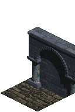
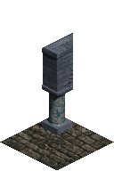

# Base Squares of Dungeon Layout 1

## 0001

### Wall SW

## 0002

### Wall SE

## 0003

### Arch NE Arch NW

## 0004

### Wall SW Wall SE

## 0005

### Arch SW Arch SE

## 0006

### Wall End SW

## 0007

### Wall End SE

## 0008

### Arch End SW

## 0009

### Arch End SE

## 0010

### Wall SW Arch SE

## 0011

### Arch SW

## 0012

### Arch SE

## 0013

### Floor

## 0014

### Arch SW Wall SE

## 0015

### Column

## 0016

### Arch End NE

## 0017

### Arch End NW

## 0022

### Dirt

## 0025

### Door SW

## 0026

### Door SE

## 0028

### Door SW Door SE

## 0030

### Door End SW

## 0031

### Door End SE

## 0040

### Door SW Arch SE

## 0041

### Door SW Wall SE

## 0042

### Arch SW Door SE

## 0043

### Wall SW Door SE

